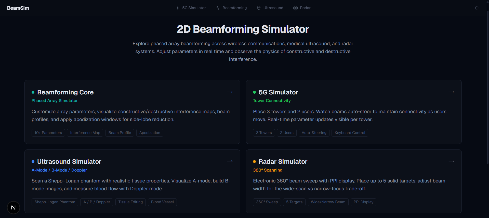
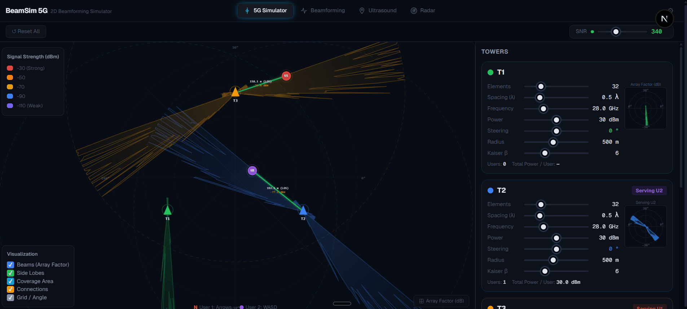

# BeamSim — 2D Beamforming Simulator

> Interactive simulation platform for visualizing phased-array beamforming and its applications in **wireless communication, medical ultrasound, and radar systems**.

<p align="center">
  
</p>

<p align="center">
  <b>Beamforming Core</b> • <b>5G Simulator</b> • <b>Ultrasound Simulator</b> • <b>Radar Simulator</b>
</p>

---

## Table of Contents

- [Overview](#overview)
- [Main Features and Demo Preview](#main-features-and-demo-preview)
- [Project Modules](#project-modules)
- [Physics Behind the Simulator](#physics-behind-the-simulator)
- [Tech Stack](#tech-stack)
- [Project Structure](#project-structure)
- [How to Run the Project](#how-to-run-the-project)
- [API Endpoints](#api-endpoints)
- [Team](#team)

---

## Overview

**BeamSim** is a full-stack educational simulator that demonstrates how phased arrays form and steer beams by controlling the phase and amplitude of multiple array elements.

The project includes a general **2D beamforming core**, then applies the same beamforming idea to three real-world scenarios:

1. **5G communications** — towers steer beams toward moving users.
2. **Medical ultrasound** — a probe scans a tissue phantom using A-mode, B-mode, and Doppler concepts.
3. **Radar** — a 360° electronic scan detects targets on a PPI-style display.


The goal is not only to show final plots, but to let the user change parameters and immediately see how the physics changes.

---

## Main Features and Demo Preview

### Beamforming 

<p align="center">
  
</p>

- Uniform Linear Array simulation.
- Real-time control of array parameters.
- Constructive and destructive interference map.
- Beam profile in Cartesian and polar views.
- Adjustable steering angle, phase offset, element spacing, frequency, SNR, and medium speed.
- Apodization/windowing support for side-lobe reduction.
- Supported windows include Rectangular, Hamming, Hanning, Blackman, Kaiser, and Tukey.

### 5G Simulator

<p align="center">
  
</p>

- Three tower system with two movable users.
- Auto-steering beams toward users.
- Connectivity check based on coverage radius and received signal power.
- Free-space path loss model.
- Multi-user power sharing.
- Interactive canvas with draggable towers/users and keyboard user movement.
- Per-tower parameter updates.


### Ultrasound Simulator

<p align="center">
  
</p>

- Shepp–Logan phantom representation.
- Editable tissue properties and vessel parameters.
- A-mode scan visualization.
- B-mode sweep/image generation.
- Doppler mode for blood-flow velocity measurement.
- Uses ultrasound-specific propagation speed and MHz-frequency range.

### Radar Simulator

<p align="center">
  
</p>


- 360° electronic beam sweep.
- PPI-style radar display.
- Up to five solid targets.
- Adjustable beam width and scan parameters.
- Target detection with threshold control.
- Demonstrates wide-beam vs narrow-beam trade-off.

---

## Project Modules

### 1. Beamforming Core

The beamforming core is the foundation of the whole project. It simulates a phased array, where many small elements transmit/receive waves together.

When the waves meet in the desired direction, they add together and produce **constructive interference**. In other directions, they may cancel each other and produce **destructive interference**.

The user can control:

- Number of elements.
- Distance between elements.
- Frequency.
- Steering angle.
- Phase offset.
- Signal type.
- SNR/noise level.
- Medium speed.
- Apodization window.

The simulator then computes:

- 2D interference map.
- Beam profile.
- Polar beam pattern.
- Window/apodization weights.
- Important beam statistics.

---

### 2. 5G Simulator

The 5G module uses beamforming in a communication scenario.

Each tower has a phased array. Instead of sending power equally in every direction, the tower steers a focused beam toward the user. When the user moves, the tower updates the steering angle to maintain connection.

This module demonstrates:

- Beam steering.
- Coverage radius.
- Received signal strength.
- Free-space path loss.
- Connection/disconnection behavior.
- Multi-user tower assignment.

---

### 3. Ultrasound Simulator

The ultrasound module uses beamforming for medical imaging.

An ultrasound probe sends waves into a tissue phantom. Reflections from different tissue regions are processed to form signals/images.

This module demonstrates:

- **A-mode:** one beam line showing echo amplitude versus depth.
- **B-mode:** many scan lines combined to create an image.
- **Doppler:** frequency shift caused by moving blood flow.
- Tissue editing and vessel control.

---

### 4. Radar Simulator

The radar module uses beamforming for target scanning.

Instead of rotating a physical antenna mechanically, the radar electronically sweeps the beam over 360°. Reflected signals are displayed in a radar-style PPI view.

This module demonstrates:

- Beam scanning.
- Target returns.
- Detection threshold.
- Beam width trade-off.
- Wide scan versus narrow focus.

---

## Physics Behind the Simulator

### Phased Array Idea

A phased array contains many elements. Each element emits a wave. By changing the phase delay between elements, the strongest direction of the combined wave can be changed.

This means the beam can be steered electronically without physically rotating the array.

### Constructive and Destructive Interference

- **Constructive interference** happens when waves arrive in phase and add together.
- **Destructive interference** happens when waves arrive out of phase and cancel each other.

The interference map visualizes where the wave field is strong and where it is weak.

### Beam Steering

Changing the phase shift between neighboring elements changes the direction where the waves add most strongly. This is the main idea behind steering angle control.

### Side Lobes

The main lobe is the strongest beam direction. Side lobes are smaller unwanted beams in other directions.

Side lobes matter because they can cause unwanted interference, false detections, or energy leakage.

### Apodization

Apodization means applying different weights to array elements instead of using all elements equally.

Window functions reduce side lobes, but usually make the main beam wider. This creates a trade-off:

- Rectangular window: narrow main lobe, higher side lobes.
- Hamming/Blackman/Kaiser windows: lower side lobes, wider main lobe.

---

## Tech Stack

### Frontend

- Next.js
- React
- TypeScript
- Tailwind CSS
- Recharts
- HTML Canvas visualizations

### Backend

- FastAPI
- Python
- NumPy
- SciPy
- Pydantic
- Uvicorn

---

## Project Structure

```text
.
├── backend/
│   ├── core/
│   │   ├── apodization.py
│   │   ├── beamforming.py
│   │   ├── noise.py
│   │   └── physics.py
│   ├── models/
│   │   └── schemas.py
│   ├── routers/
│   │   ├── beamforming_router.py
│   │   ├── fiveg_router.py
│   │   ├── radar_router.py
│   │   └── ultrasound_router.py
│   ├── simulators/
│   │   ├── fiveg.py
│   │   ├── phantom.py
│   │   ├── radar.py
│   │   └── ultrasound.py
│   ├── main.py
│   └── requirements.txt
│
└── frontend/
    ├── public/
    │   └── docs/
    │       ├── screenshots/
    │       └── gifs/
    ├── src/
    │   ├── app/
    │   │   ├── beamforming/
    │   │   ├── fiveg/
    │   │   ├── radar/
    │   │   ├── ultrasound/
    │   │   ├── layout.tsx
    │   │   └── page.tsx
    │   ├── components/
    │   │   └── layout/
    │   └── lib/
    │       └── api.ts
    └── package.json
```

---

## How to Run the Project

### 1. Clone the Repository

```bash
git clone https://github.com/YOUR_USERNAME/YOUR_REPOSITORY_NAME.git
cd YOUR_REPOSITORY_NAME
```

---

### 2. Run the Backend

Open a terminal in the project root:

```bash
cd backend
python -m venv venv
```

Activate the virtual environment.

On Windows:

```bash
venv\Scripts\activate
```

On macOS/Linux:

```bash
source venv/bin/activate
```

Install dependencies:

```bash
pip install -r requirements.txt
```

Run the FastAPI server:

```bash
uvicorn main:app --reload
```

The backend will run at:

```text
http://localhost:8000
```

You can test it by opening:

```text
http://localhost:8000/health
```

---

### 3. Run the Frontend

Open another terminal in the project root:

```bash
cd frontend
npm install
npm run dev
```

The frontend will run at:

```text
http://localhost:3000
```

---

## API Endpoints

### General

| Method | Endpoint | Description |
|---|---|---|
| GET | `/` | API welcome message |
| GET | `/health` | Backend health check |

### Beamforming

| Method | Endpoint | Description |
|---|---|---|
| POST | `/api/beamforming/compute` | Compute interference map, beam profile, and beam statistics |
| GET | `/api/beamforming/windows` | Return available apodization windows |

### 5G

| Method | Endpoint | Description |
|---|---|---|
| POST | `/api/fiveg/simulate` | Simulate tower-user connectivity |
| POST | `/api/fiveg/move-user` | Update user position |

### Ultrasound

| Method | Endpoint | Description |
|---|---|---|
| GET | `/api/ultrasound/phantom` | Get phantom data |
| PUT | `/api/ultrasound/phantom/tissue` | Update tissue properties |
| PUT | `/api/ultrasound/phantom/geometry` | Update phantom geometry |
| PUT | `/api/ultrasound/phantom/vessel` | Update vessel properties |
| POST | `/api/ultrasound/a-mode` | Run A-mode scan |
| POST | `/api/ultrasound/b-mode` | Run B-mode sweep |
| POST | `/api/ultrasound/doppler` | Run Doppler scan |

### Radar

| Method | Endpoint | Description |
|---|---|---|
| POST | `/api/radar/scan` | Run single radar scan |
| POST | `/api/radar/scan-sector` | Run radar sector/360° sweep |
| POST | `/api/radar/detect` | Detect targets from radar returns |

---


## Notes

This project was built as an educational beamforming simulator. It focuses on helping users visually understand how phased arrays work and how the same concept appears in communication, ultrasound imaging, and radar scanning.

---

## Contributors

<div align="center">

<table>
  <tr>
    <td align="center">
      <a href="https://github.com/hamdy-fathi">
        <br/>
        <sub><b>Hamdy Ahmed</b></sub>
      </a>
    </td>
    <td align="center">
      <a href="https://github.com/OmegasHyper">
        <br/>
        <sub><b>Mohamed Abdelrazek</b></sub>
      </a>
    </td>
    <td align="center">
      <a href="https://github.com/Chron1c-24">
        <br/>
        <sub><b>Yousef Samy</b></sub>
      </a>
    </td>
    <td align="center">
      <a href="https://github.com/YomnaSabry172">
        <br/>
        <sub><b>Youmna Sabry</b></sub>
      </a>
    </td>
  </tr>
</table>

</div>
